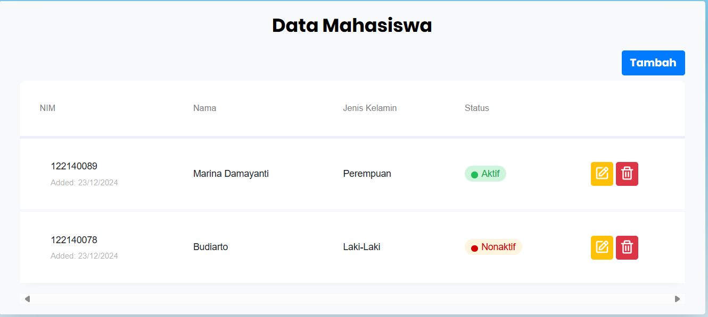

# Student Data Management System

## 📋 Overview

This repository contains the source code for a student data management system, allowing users to register, login, and manage student records through a web interface.

## 🛠️ Tech Stack

- **Frontend:** <a href="https://developer.mozilla.org/en-US/docs/Web/HTML" style="cursor: pointer;"></a> <a href="https://developer.mozilla.org/en-US/docs/Web/CSS" style="cursor: pointer;"></a> <a href="https://developer.mozilla.org/en-US/docs/Web/JavaScript" style="cursor: pointer;"></a> <a href="https://jquery.com/" style="cursor: pointer;"></a>
- **Backend:** <a href="https://www.php.net/" style="cursor: pointer;"></a>
- **Styling:** <a href="https://getbootstrap.com/" style="cursor: pointer;"></a>
- **Database:** <a href="https://www.mysql.com/" style="cursor: pointer;"></a>
- **Version Control:** <a href="https://git-scm.com/" style="cursor: pointer;"></a>

## 🔧 Installation & Setup

1. Clone the repository
   ```
   git clone https://github.com/1wikii/pemweb-pendataan-mahasiswa.git
   ```
2. Navigate to project directory
   ```
   cd pemweb-pendataan-mahasiswa
   ```
3. Set up your database

   ```
   $ mysql -u root -p

   mysql> CREATE DATABASE data_mahasiswa;
   ```

4. Configure database connection in `config/database.php`
5. Run on a PHP server
   ```
   php -S localhost:8000
   ```

## 📁 Project Structure

```
pemweb-pendataan-mahasiswa/
├── assets/
├── config/
├── css/
├── fonts/
├── middleware/
├── objects/
├── views/
└── ...
```

## 📷 Screenshots

<div align="center" style="display: flex; flex-direction: column; gap: 20px; justify-content: center; align-items: center;">
   
   
</div>

<!-- ## 🔗 Live Demo

[View the live website](https://your-demo-url.com) -->

## 📝 License

This project is licensed under the MIT License - see the [LICENSE](LICENSE) file for details.
