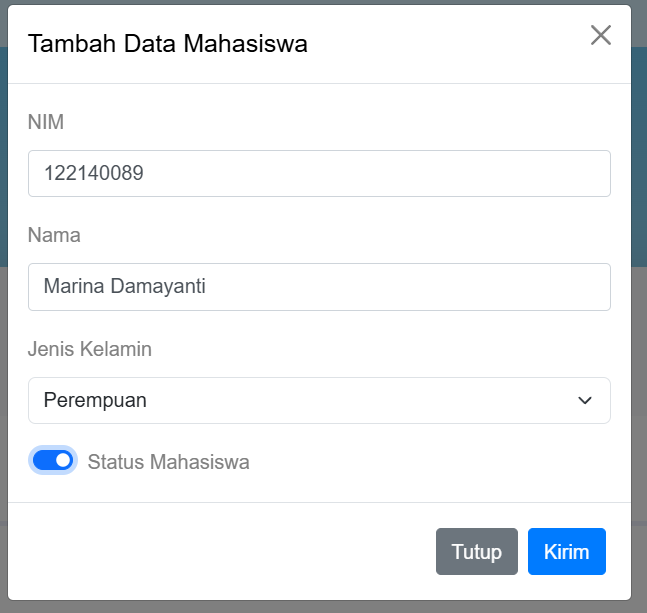
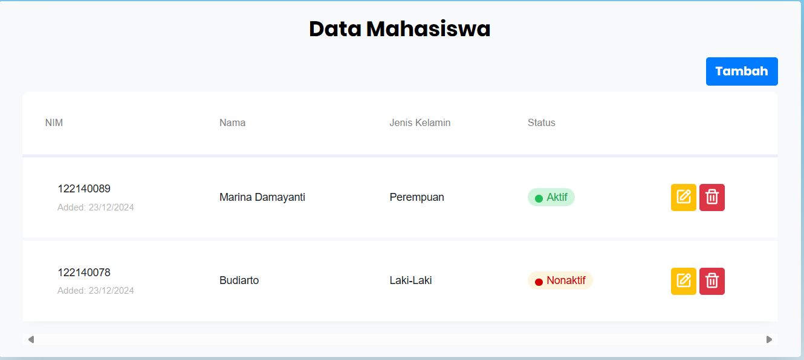
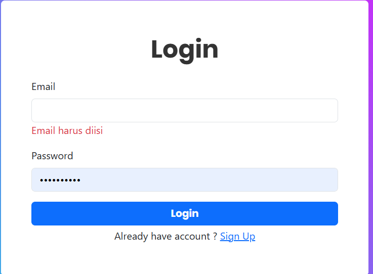
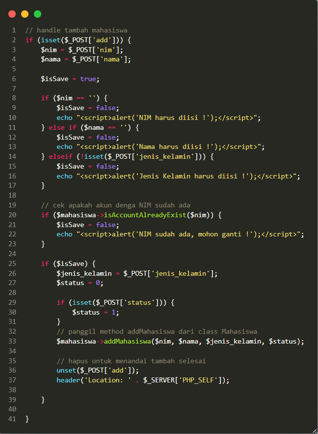
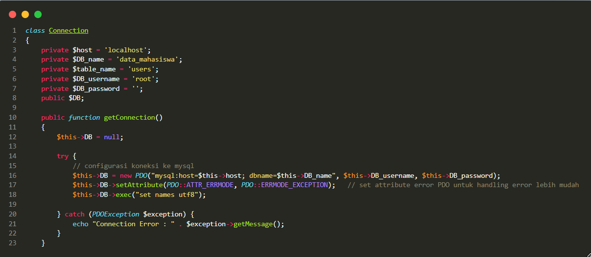
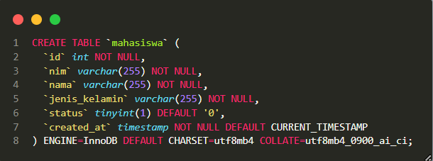
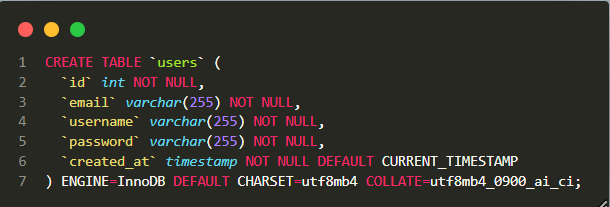
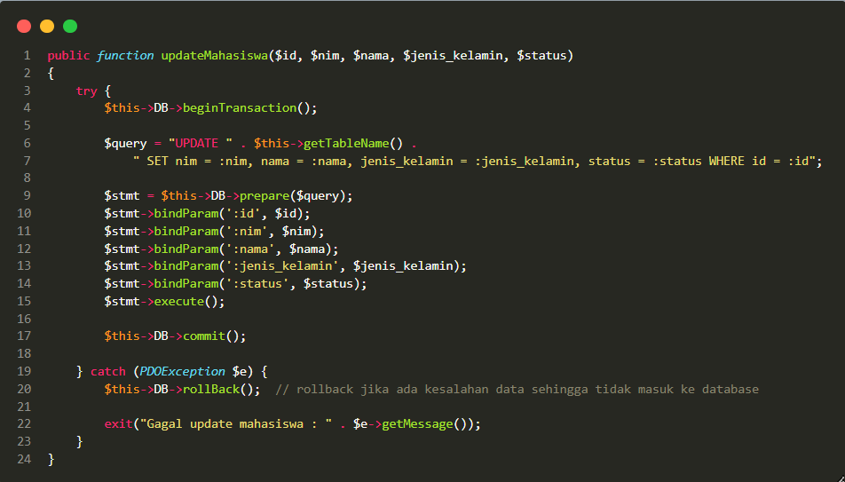
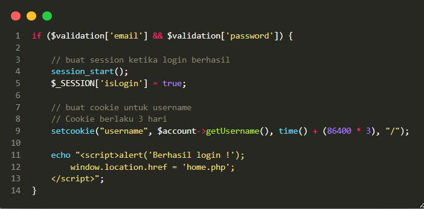
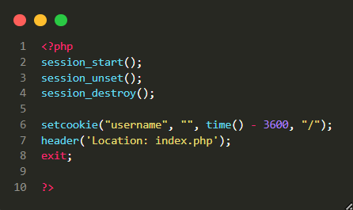

 

  

<h3 align="center">Sistem Pendataan Mahasiswa</h3>

  

    Website pendataan mahasiswa untuk pemenuhan UAS Pemweb
  

# Biodata

**Nama** : `Muhammad Fauzan Saputra`
 
**NIM** : `20083000019`

# Stack Teknologi

- [![Bootstrap][Bootstrap.com]][Bootstrap-url]
- [![JQuery][JQuery.com]][JQuery-url]
- [![PHP][PHP]][PHP-url]

# Client-side Programming

## 1.1 Manipulasi DOM dengan JavaScript

- Membuat input menggunakan beberapa jenis input tag
   
  `Text`, `Select`, `Checkbox`
   
  
   

* Menampilkan data yang telah diinputkan ke dalam tabel
* Menampilkan data yang diambil dari tabel menggunakan PHP
   
  

## 1.2 Event Handling

- Menggunakan jquery untuk lakukan validasi input
   
  

# Server-side Programming

## 2.1 Pengelolaan Data dengan PHP

- Menggunakan method `GET` untuk mengambil data dari tabel

* Menggunakan method `POST` untuk menambahkan data ke tabel
   
  

## 2.2 Objek PHP Berbasis OOP

- Menggunakan konsep `OOP` untuk membuat class `Mahasiswa`, `User` dan `Connection` untuk mempermudah penggunaan database
   
  

# Database Management

## Pembuatan Tabel Database

- Membuat tabel `mahasiswa` dan `user`
   
  
   
  

## Konfigurasi Koneksi Database

- Membuat file `database.php` untuk mengatur koneksi database
   
  

## Manipulasi Data pada Database

- Manipulasi data pada database dengan add, update dan delete
   
  

# State Management

## State Management dengan Session

- Membuat session untuk menyimpan data user yang login

* Membuat cookies untuk menyimpan data username user yang login
   
  

## Pengelolaan State dengan Cookie dan Browser Storage

- Menghapus session dan cookie ketika user logout
   
  

[Bootstrap.com]: https://img.shields.io/badge/Bootstrap-563D7C?style=for-the-badge&logo=bootstrap&logoColor=white
[JQuery.com]: https://img.shields.io/badge/jQuery-0769AD?style=for-the-badge&logo=jquery&logoColor=white
[PHP]: https://img.shields.io/badge/PHP-777BB4?style=for-the-badge&logo=php&logoColor=white
[Bootstrap-url]: https://getbootstrap.com/
[JQuery-url]: https://jquery.com/
[PHP-url]: https://www.php.net/
